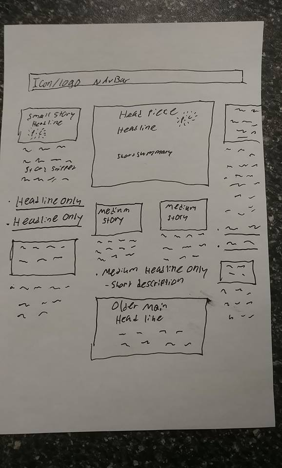

# Right Now

Just work on styling to show

# Guidelines

## Visual

* white and blue color theme
* Under headers, lead article should appear like a banner of a banner
* Rest should be news papery with layout
* Important pages: Home, about, contact
* Tile pieces are a bit too close together
* If a new logo is thinkable, do it
* Main Headline is page-wide at top

#### Visual Thoughts

* Below main headline, two columns holding the features
* Maybe have the two columns have two sub-columns that only expand on screen-wide viewport
* (two column page): Old main headlines on left, these have the picture, headline, small preview. The right side is just headlines of non-features

## Database implementations 

* Easily updatable front-page, latest article first
* Search tags implementation
* Split the array/object being parsed. eg pictured store 1-3 then text-link only stories 3-8; pictured > textlink > pictured > text-link etc. . .
* ^^ scripting to control layout, e.g. throwing them in a few different variables then mapped to the page in the respective variable location
* Maybe give the object a property that will be assigned on a load. After load, the property is set and won't be changed. This way, it won't change the position because of how items are being fed to the page for display.
* A type-tag should accompany the article object, if it's a header or old header, only old headers will have pictures (this may change, but for now, this is the plan)
* Easy sharing to FaceBook and Twitter is a must

# Quick Visual Reference
* One possibility: 

# Quick note 

If react auto-adds a .git file for you and you don't notice, you will be wondering why nothing is being pushed. Delete any .git files react makes for you. Your life will thank you for the added quality.

Be sure to delete it before you create another .git file